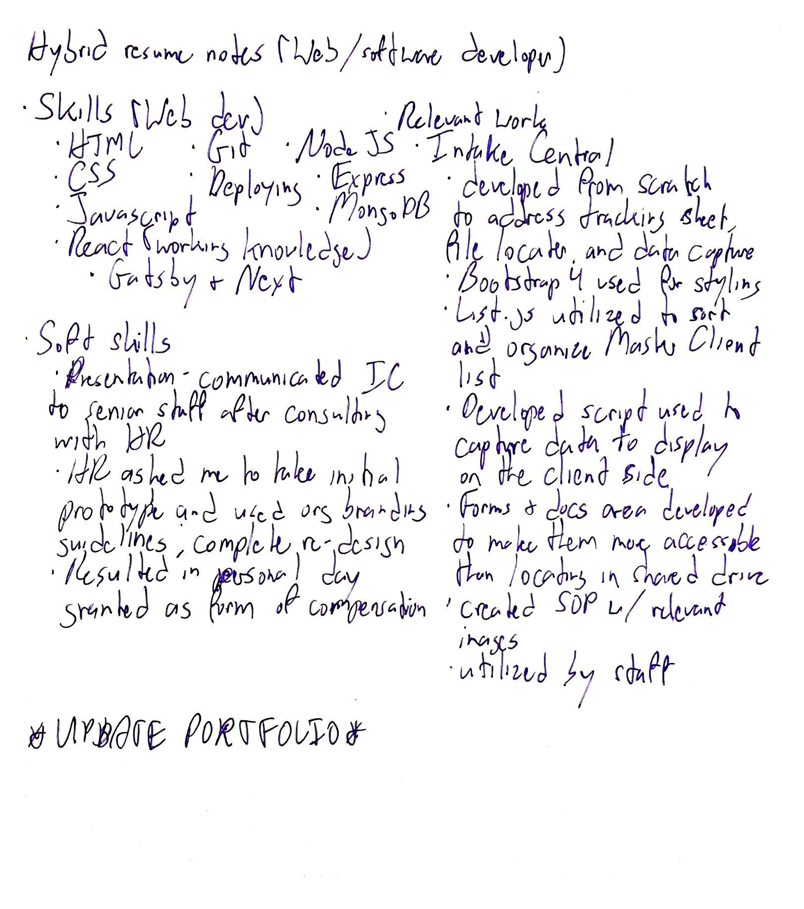
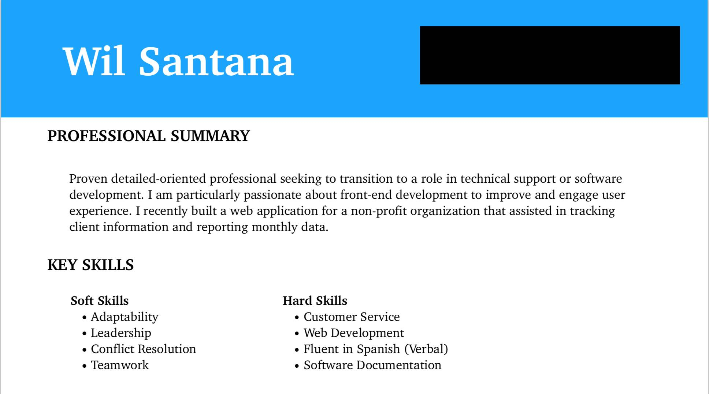

Recently I inteded to go to a job fair. I got 25 copies of my resume ready to show off to potential employers. Before the job fair started I decided to have breakfast and use that time to come up with talking points. 

<figure>
  
  <figcaption style="text-align: center; font-size: 12px; color: #A9A9A9">A little self-reflection over breakfast</figcaption>
</figure>

As I wrote down what were my hard and soft skills as well as potential answers to interview questions, I looked over my resume and realized there's no way I can turn that in to potential employers. It was far too specific to a particular industry. At that moment I decided to not attend the job fair as this resume did not entirely reflect my professional growth. More importantly it generally failed to communicate what value I can add to a potential employer. 

<figure>
  
  <figcaption style="text-align: center; font-size: 12px; color: #A9A9A9">Plus it's an eye sore</figcaption>
</figure>

### Re-inventing the resume

The first step I took was to take my list of skills and somehow capsulate it into a one page resume. 

<figure>
  
  <figcaption style="text-align: center; font-size: 12px; color: #A9A9A9">A little bit of everything it seems</figcaption>
</figure>

I researched various resume writing sites and while they all had differing points of view as to what should and shouldn't go into a resume, the common message was to keep a resume as consise as possible. After much consideration into what format I should use, I went with the hybrid/combination resume. The reason for this is because while I had a lengthy stint with my most recent employer in the affordable housing industry where presentation and people skills were paramount, I also took web development courses in my spare time. To me this format is the best way to present both sides to potential employers. 

While the content of a resume is considered most important, I also had to consider the layout and overall presentation. I found many great looking resumes just by looking at Google Images as well as the templates provided on Google Docs, I decided to challenge myself by taking a template format and building it from scratch. The end result was satisfying to say the least.

<figure>
  
  <figcaption style="text-align: center; font-size: 12px; color: #A9A9A9">Ah that's more like it!</figcaption>
</figure>

Suddenly feeling inspired I've gone ahead with also making some much needed updates to my web developer portfolio. I'll save that one for the next post. :)
