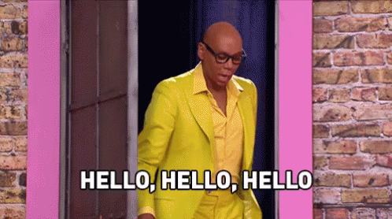
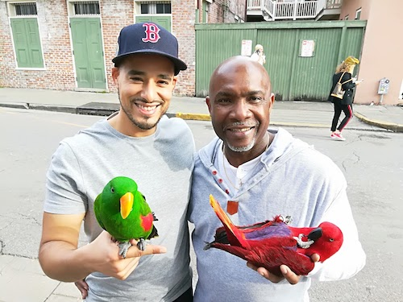

My name is Wil Santana aka fredo_omega. I'm freelance web developer who is currently seeking my first real position in this field. The purpose of this blog is to document my journey as well as provide content on hobbies and interests that I'm into such as Nintendo, working out, finding great places to eat, discovering new shows on Netflix, and just maintaining my general awesomeness!

## Creating this blog

This was created using [Gatsby](https://www.gatsbyjs.org/) which is a static site generator. The reason why I chose this is because it runs on the React. Seeing as if the React framework is considered one of the hottest trends in web development, I figured this is an efficient way to learn React while simultaneously creating and maintaining this blog. If you're interested in building a blog with Gatsby (or any other static site), I found this [tutorial](https://daveceddia.com/start-blog-gatsby-netlify/) that will help get your started in no time. Concepts I picked up from this tutorial include:

- Installing Gatsby on my local machine
- Updating the gatsby-config file to make the template blog my own
- Generate blog posts using a language called Markdown
- Deploying the blog with the power of Github and Netlify

The Gatsby documentation and tutorial go into detail on how to create a Gatsby app from scratch 

### What to expect from this blog

As Julie Chen says on the hit reality show "Big Brother", expect the unexpected. Generally I do plan on creating two posts a day with one covering any web development topics I'm currently working on (such as building HTML emails thanks to a course on [Coding Phase](https://codingphase.com/)) and the other will cover general interests and hobbies (such as what music I listen to when coding or talking about Netflix shows/movies like "The Perfection"). 

Thanks for visiting and I'm looking forward to this journey! For now enjoy this pic of my recent trip to New Orleans:

